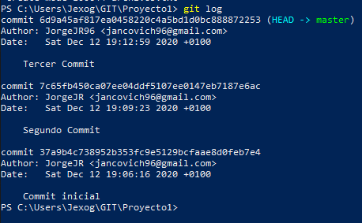

#    Practica GIT. Inicial 
###  Clonar repositorio externo
###  Creación de repositorio local
######   Jorge Jankovich Ramos - 2020

## Clonar repositorio externo

1. En un terminal posicionaros donde se creará el directorio del proyecto. 
Con el comando "cd" nos situamos dentro del directorio donde creamos el proyecto. 

2. Clonar el proyecto de la libreria Jquery que lo mantiene en github. https://www.github.com/jquery/jquery.git 
Con el comando "clone" clonamos la librería dentro del directorio. 

3. Entrar en el directorio creado (jquery) y mostrad un log de los estados por los que ha pasado el proyecto. 
Con cd accedemos al directorio de la libreria que hemos clonado y mostramos los estados del proyecto con "git log". 

## Crear un repositorio local

1. Crear un directorio donde vamos a empezar el proyecto y acceder a él.
Creamos el directorio del proyecto con mkdir y nos situamos dentro de el. 

2. Inicializar el repositorio 
Inicializamos el respositorio con "git init". Si accedemos a la carpeta, podemos ver una carpeta oculta con el nombre ".git". 

3. Cread un primer archivo "archivo1.txt"
Creamos el archivo archivo1.txt con ni. 

4. Visualizad el estado del proyecto
git status nos permite ver el estado, no se ha realizado ningun commit aun y nos avisa por la pantalla de que el nuevo archivo no esta preparado. 

5. Pasad el archivo del espacio de trabajo a la zona de preparación.
Llevamos el archivo1.txt a la zona de preparación con "git add". 

6. Visualizad de nuevo el estado del proyecto.
Podemos ver los cambios realizados en el archivo1.txt, preparado para el commit. 

7. Realizad el primer commit y visualizad de nuevo el estado del proyecto.
"commit -m "comentario commit"" 

8. Cread dos archivos más al proyecto. "archivo2.txt" y "archivo3.txt" 

9. Pasad el segundo archivo a la zona de preparación. 

10. Segundo commit del proyecto. 

11. Añadid el ultimo archivo a la zona de preparación y realizad el commit. 

12. Mostrad el log de todos los cambios. 
Podemos ver todos los commits realizados. 

13. Cambiad el archivo "archivo1.txt" y verificad el estado de git. 
Hemos realizado un cambio dentro del txt y status nos avisa de que no hemos realizado commit despues de los cambios realizos en archivo.txt. 

14. Pasad el archivo a la zona de preparación. 
git add para llevar a la zona de preparacion al archivo1 modificado. 

15. Modificad los archivos 2 y 3 del proyecto. Verificad estado del git. 
Realizamos cambios tambien a archivo2 y archivo3, vemos en status que archivo1 ya esta preparado para el commit, pero los otros dos archivos no. 

16. Pasad los archivos 2 y 3 a la zona de preparación. 
git add a archivo2 y archivo3. 

17. Realizar el commit de los cambios realizados. 
Realizamos un ultimo commit con los ultimos 2 archivos. 

18. Mostrad el log de todos los cambios. 
Podemos ver todos los commits realizados. 

